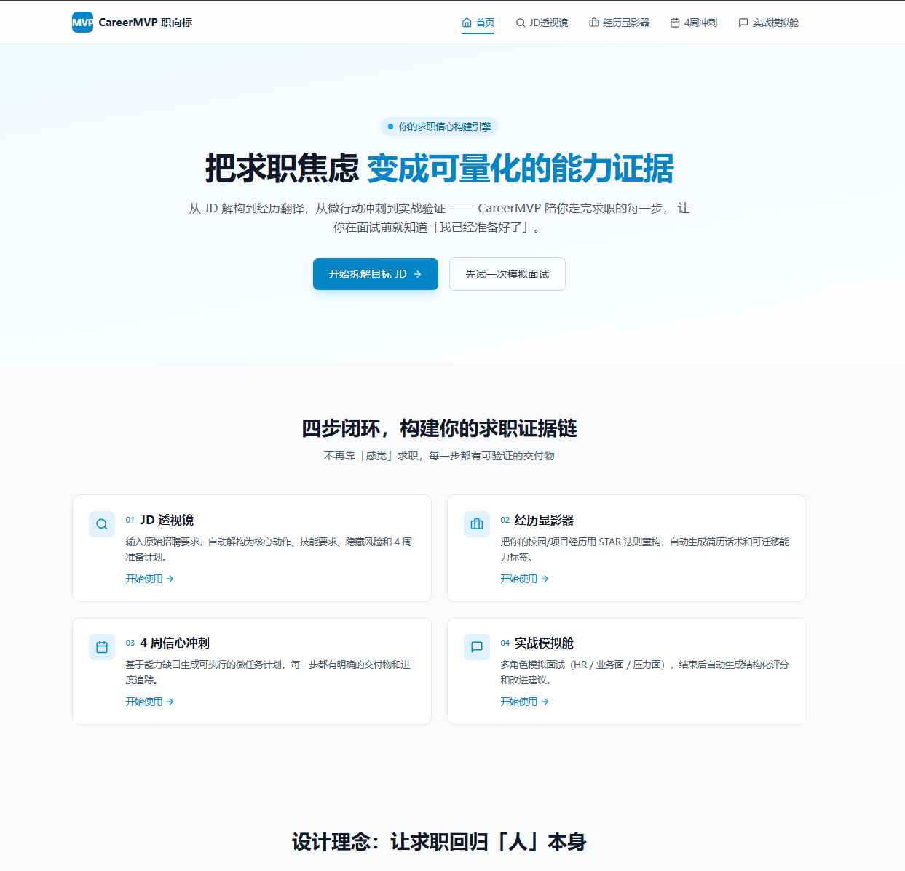

# 🎯 CareerMVP 职向标

> **面向求职期大学生的「信心构建引擎」**
>
> 通过 `JD解构 → 经历翻译 → 微行动冲刺 → 实战验证` 闭环，将求职焦虑转化为可量化的能力证据。

[](https://nextjs.org/)
[](https://www.typescriptlang.org/)
[](https://tailwindcss.com/)
[](https://vercel.com)
[](LICENSE)

***

## 📋 目录

- [✨ 核心功能](#-核心功能)
- [🛠️ 技术架构](#️-技术架构)
- [📦 快速开始](#-快速开始)
- [📁 项目结构](#-项目结构)
- [🎯 核心模块说明](#-核心模块说明)
- [⚙️ 环境配置](#️-环境配置)
- [🚀 部署指南](#-部署指南)
- [🧪 测试](#-测试)
- [🔒 安全与隐私](#-安全与隐私)
- [📝 开发指南](#-开发指南)
- [🤝 贡献指南](#-贡献指南)
- [📄 许可证](#-许可证)

***

## ✨ 核心功能



### 1. 📄 JD 透视镜


- **智能解析**：粘贴原始招聘要求，自动提取核心信息
- **结构化输出**：
  - 核心工作动作
  - 硬技能要求（编程语言、工具、框架）
  - 软技能要求（沟通、协作、问题解决）
  - 隐藏风险提示（加班文化、指标压力等）
- **一键导出**：支持复制为 Markdown 格式

### 2. 🔄 经历显影器


- **STAR 重构**：将松散的经历描述转换为规范的 STAR 结构
- **能力标签**：自动提取可迁移技能标签
- **简历话术**：生成 1 句话简历核心描述
- **一键复制**：支持 `Ctrl+C` 直接复制

### 3. 🗓️ 4 周信心冲刺


- **多 JD 聚合**：支持输入 1-3 个目标岗位 JD，自动聚合共同要求
- **能力差距分析**：
  - 严标准匹配策略
  - 量化技能覆盖度 (0-100%)
  - 优先级排序 (Critical/High/Medium/Low)
- **个性化计划**：
  - 考虑用户每天可用时间
  - 考虑用户当前水平（入门/进阶/高级）
  - 3 种优先级策略
  - 生成 4 周 × 2-3 个微任务
- **实时进度**：流式响应，可视化展示 4 阶段进度
- **本地持久化**：IndexedDB 存储，支持离线使用

### 4. 🎙️ 实战模拟舱


- **多角色切换**：HR 面 / 业务面 / 压力面
- **流式交互**：基于 `@ai-sdk/react` 的 `useChat` 钩子
- **上下文管理**：自定义 `useMemoryCompressor`，智能压缩历史对话
- **结构化反馈**：
  - 综合评分 (0-100)
  - 优点清单
  - 改进点清单
  - 优化后的 STAR 回答示例

    <br />

***

## 🛠️ 技术架构

### 系统架构图

```
┌─────────────────────────────────────────────────────────────────┐
│                        Client (Browser)                           │
│  ┌─────────────────────────────────────────────────────────┐   │
│  │  Next.js 14 (App Router) │ Tailwind CSS │ Zustand       │   │
│  │  ┌─────────┐ ┌──────────┐ ┌──────────┐ ┌──────────────┐│   │
│  │  │ JD透视镜│ │经历显影器│ │4周冲刺计划│ │ 实战模拟舱   ││   │
│  │  └─────────┘ └──────────┘ └──────────┘ └──────────────┘│   │
│  └─────────────────────────────────────────────────────────┘   │
│                              │                                    │
│  ┌─────────────────────────────────────────────────────────┐   │
│  │                    Local Storage                          │   │
│  │  Zustand Store + idb-keyval (IndexedDB)                 │   │
│  │  • 进度持久化  • 草稿保存  • 面试记录                    │   │
│  └─────────────────────────────────────────────────────────┘   │
└──────────────────────────────────────┬──────────────────────────┘
                                       │
                          HTTPS / SSE / Streaming
                                       │
┌──────────────────────────────────────▼──────────────────────────┐
│                     API Routes (Serverless)                      │
│  ┌──────────────┐ ┌────────────────┐ ┌────────────────────────┐│
│  │  /api/jd-    │ │ /api/          │ │  /api/sprint-workflow  ││
│  │  parse       │ │ experience-map │ │  (增强版工作流)         ││
│  ├──────────────┤ ├────────────────┤ ├────────────────────────┤│
│  │  /api/       │ │ /api/feedback │ │  /api/sprint-plan      ││
│  │  mock-chat   │ │                │ │  (兼容旧版)             ││
│  └──────────────┘ └────────────────┘ └────────────────────────┘│
│                                                                   │
│  ┌─────────────────────────────────────────────────────────┐   │
│  │                    Zod Schema 校验层                      │   │
│  │  • LLM 输出强校验  • API 输入校验  • 类型安全            │   │
│  └─────────────────────────────────────────────────────────┘   │
└──────────────────────────────────────┬──────────────────────────┘
                                       │
                          @ai-sdk Unified Interface
                                       │
┌──────────────────────────────────────▼──────────────────────────┐
│                   LLM Provider (OpenAI 兼容)                      │
│  ┌──────────────┐ ┌────────────────┐ ┌────────────────────────┐│
│  │  DeepSeek    │ │ SiliconFlow    │ │  OpenAI / 本地 Ollama   ││
│  │  (默认)      │ │                │ │  (可切换)                ││
│  └──────────────┘ └────────────────┘ └────────────────────────┘│
└─────────────────────────────────────────────────────────────────┘
```

### 技术栈选型

| 层级        | 技术                                  | 选型理由                                 |
| --------- | ----------------------------------- | ------------------------------------ |
| **框架**    | Next.js 14 (App Router)             | SSR/CSR 混合，路由清晰，内置 API Routes，SEO 友好 |
| **UI/样式** | TailwindCSS 3.4                     | 原子化样式快速开发，暗色模式原生支持                   |
| **AI 交互** | `@ai-sdk/react` + `@ai-sdk/openai`  | 官方流式钩子 `useChat`，内置工具调用、记忆管理、多模型路由   |
| **数据校验**  | `Zod`                               | 强类型 Schema 约束 LLM 输出，防止前端解析崩溃        |
| **状态管理**  | `Zustand`                           | 轻量状态管理，API 简洁，支持中间件                  |
| **本地存储**  | `idb-keyval`                        | 浏览器 IndexedDB 封装，支持离线持久与大容量存储        |
| **动效/图标** | `Framer Motion` + `Lucide React`    | 进度条、完成弹窗、卡片展开，强化"信心可视化"反馈            |
| **测试**    | `Vitest` + `@testing-library/react` | 快速、现代的测试框架，支持 ESM                    |
| **部署**    | `Vercel`                            | 零配置 CI/CD，自动 Edge 分发，免费额度充足          |

### 4 阶段工作流架构

冲刺计划生成采用 **4 阶段编排工作流**：

```
┌─────────────────────────────────────────────────────────────────┐
│                    冲刺计划生成复杂工作流                          │
├─────────────────────────────────────────────────────────────────┤
│                                                                   │
│  ┌──────────────┐    ┌──────────────┐    ┌──────────────┐      │
│  │ 阶段 1:      │───▶│ 阶段 2:      │───▶│ 阶段 3:      │      │
│  │ 多 JD 聚合   │    │ 能力差距分析 │    │ 个性化计划生成 │      │
│  │ 与提炼       │    │              │    │              │      │
│  └──────────────┘    └──────────────┘    └──────────────┘      │
│         ▲                    │                    │               │
│         │                    ▼                    ▼               │
│  ┌──────────────────────────────────────────────────────────┐    │
│  │  输入:                                                    │    │
│  │  • 1-3 个 JD 文本                                        │    │
│  │  • 0-10 段经历文本（可选）                               │    │
│  │  • 偏好设置（时间、水平、策略）                          │    │
│  └──────────────────────────────────────────────────────────┘    │
│                              │                                    │
│                              ▼                                    │
│                    ┌──────────────┐                              │
│                    │ 阶段 4:      │                              │
│                    │ 计划优化     │                              │
│                    │ 与确认       │                              │
│                    └──────────────┘                              │
│                              │                                    │
│                              ▼                                    │
│  ┌──────────────────────────────────────────────────────────┐    │
│  │  输出:                                                    │    │
│  │  • 聚合后的岗位能力画像 (AggregatedJDProfile)            │    │
│  │  • 能力差距分析结果 (GapAnalysisResult)                   │    │
│  │  • 个性化冲刺计划 (PersonalizedSprintPlan)               │    │
│  │  • 优化后的最终计划 (OptimizedSprintPlan)                │    │
│  │  • 简化版计划 (兼容旧版)                                  │    │
│  │  • 差距报告 (GapReport)                                   │    │
│  └──────────────────────────────────────────────────────────┘    │
│                                                                   │
└─────────────────────────────────────────────────────────────────┘
```

***

## 📦 快速开始

### 环境要求

- Node.js >= 18.17.0
- npm >= 9.x 或 pnpm >= 8.x
- 有效的 LLM API Key（支持 OpenAI 兼容格式）

### 安装步骤

1. **克隆仓库**

```bash
git clone <repository-url>
cd CareerMVP
```

1. **安装依赖**

```bash
npm install
# 或
pnpm install
```

1. **配置环境变量**

```bash
# 复制环境变量模板
cp .env.local.example .env.local
```

编辑 `.env.local` 文件：

```env
# LLM 配置
OPENAI_API_KEY=your-api-key-here
OPENAI_BASE_URL=https://api.deepseek.com  # 可选，兼容 OpenAI 格式
LLM_MODEL=deepseek-chat  # 模型名称

# 可选配置
NEXT_PUBLIC_APP_NAME=CareerMVP 职向标
NEXT_PUBLIC_APP_URL=http://localhost:3000
```

1. **启动开发服务器**

```bash
npm run dev
```

访问 <http://localhost:3000> 即可看到应用。

### 常用命令

```bash
# 开发模式
npm run dev

# 生产构建
npm run build

# 启动生产服务器
npm run start

# 类型检查
npm run typecheck

# 运行测试
npm run test

# 运行测试（监视模式）
npm run test:watch

# 代码检查
npm run lint
```

***

## 📁 项目结构

```
CareerMVP/
├── .github/                    # GitHub 配置
├── .next/                      # Next.js 构建输出
├── node_modules/               # 依赖包
├── public/                     # 静态资源
│   ├── favicon.ico
│   └── ...
├── src/
│   ├── app/                    # Next.js App Router
│   │   ├── api/                # API 路由
│   │   │   ├── experience-map/ # 经历映射 API
│   │   │   ├── feedback/       # 反馈生成 API
│   │   │   ├── jd-parse/       # JD 解析 API
│   │   │   ├── mock-chat/      # 模拟对话 API (Edge Runtime)
│   │   │   ├── sprint-plan/    # 冲刺计划 API (旧版)
│   │   │   └── sprint-workflow/# 冲刺计划工作流 API (增强版)
│   │   ├── jd-parser/          # JD 透视镜页面
│   │   ├── experience/         # 经历显影器页面
│   │   ├── sprint/             # 4 周冲刺页面
│   │   ├── mock/               # 实战模拟舱页面
│   │   ├── design-workflow/    # 工作流设计文档页面
│   │   ├── globals.css         # 全局样式
│   │   ├── layout.tsx          # 根布局
│   │   └── page.tsx            # 首页
│   │
│   ├── components/             # 公共组件
│   │   └── Navbar.tsx          # 导航栏组件
│   │
│   ├── hooks/                  # 自定义 Hooks
│   │   ├── useMemoryCompressor.ts    # 记忆压缩 Hook
│   │   └── useMemoryCompressor.test.ts # 测试
│   │
│   ├── lib/                    # 工具库
│   │   ├── ai.ts               # AI 模型配置
│   │   ├── schemas.ts          # Zod 类型定义
│   │   └── schemas.test.ts     # 测试
│   │
│   ├── store/                  # 状态管理
│   │   └── useProgressStore.ts # 进度状态 Store
│   │
│   └── workflow/               # 工作流编排
│       ├── index.ts            # 统一导出
│       ├── types.ts            # 工作流类型定义
│       ├── orchestrator.ts     # 编排器主逻辑
│       └── stages/             # 阶段执行函数
│           ├── stage1-aggregate.ts   # JD 聚合与提炼
│           ├── stage2-analyze.ts     # 能力差距分析
│           ├── stage3-generate.ts    # 个性化计划生成
│           └── stage4-optimize.ts    # 计划优化与确认
│
├── .env.example                 # 环境变量模板
├── .env.local.example           # 本地环境变量模板
├── .eslintrc.json               # ESLint 配置
├── .gitignore                   # Git 忽略配置
├── next.config.js               # Next.js 配置
├── package.json                 # 项目配置
├── postcss.config.js            # PostCSS 配置
├── README.md                    # 本文档
├── tailwind.config.js           # Tailwind 配置
├── tsconfig.json                # TypeScript 配置
└── vitest.config.ts             # Vitest 配置
```

***

## 🎯 核心模块说明

### 1. JD 透视镜 (`/api/jd-parse`)

**功能**：解析招聘要求，提取结构化信息

**输入**：

```typescript
{
  text: string;  // JD 原始文本
}
```

**输出**：

```typescript
{
  core_actions: string[];           // 核心工作动作
  mvs_skills: {
    hard: string[];                 // 硬技能
    soft: string[];                 // 软技能
  };
  hidden_risks: string[];          // 隐藏风险
  weekly_proof: [                   // 简单版 4 周计划
    {
      week: number;
      task: string;
      proof_type: '截图' | '链接' | '文档' | '代码';
    }
  ];
}
```

**位置**：`src/app/api/jd-parse/route.ts`

### 2. 经历显影器 (`/api/experience-map`)

**功能**：将松散经历转换为 STAR 结构

**输入**：

```typescript
{
  experience: string;  // 经历原始文本
  jdContext?: string;  // 可选的 JD 上下文
}
```

**输出**：

```typescript
{
  original: string;                    // 原始文本
  optimized: {
    situation: string;                 // 情境
    task: string;                      // 任务
    action: string;                    // 行动
    result: string;                    // 结果
  };
  transferable_skills: string[];       // 可迁移技能
  resume_line: string;                 // 简历核心话术
}
```

**位置**：`src/app/api/experience-map/route.ts`

### 3. 冲刺计划工作流 (`/api/sprint-workflow`)

**功能**：4 阶段编排工作流，支持多 JD 聚合和差距分析

**输入**：

```typescript
{
  rawJDs: [                          // 1-3 个 JD
    {
      id: string;
      title?: string;
      content: string;
    }
  ];
  rawExperiences?: [                 // 可选：0-10 段经历
    {
      id: string;
      title?: string;
      content: string;
    }
  ];
  preferences: {
    dailyHoursAvailable: number;     // 每天可用小时数 (0.5-8)
    currentLevel: 'beginner' | 'intermediate' | 'advanced';
    priorityStrategy: 'critical-first' | 'balanced' | 'confidence-first';
  };
  stream: boolean;                   // 是否流式响应
}
```

**流式响应事件**：

- `stage-progress`：阶段进度
- `stage-complete`：阶段完成
- `workflow-error`：工作流错误
- `workflow-complete`：工作流完成

**位置**：`src/app/api/sprint-workflow/route.ts`

**编排器位置**：`src/workflow/orchestrator.ts`

### 4. 实战模拟舱 (`/api/mock-chat`)

**功能**：流式对话接口，使用 Edge Runtime

**特点**：

- 基于 `@ai-sdk/react` 的 `useChat` 钩子
- 支持多角色切换
- 自定义上下文压缩
- Edge Runtime，冷启动 < 100ms

**位置**：`src/app/api/mock-chat/route.ts`

***

## ⚙️ 环境配置

### 环境变量说明

| 变量名               | 必填 | 默认值             | 说明                       |
| ----------------- | -- | --------------- | ------------------------ |
| `OPENAI_API_KEY`  | ✅  | -               | LLM API 密钥               |
| `OPENAI_BASE_URL` | ❌  | -               | API 基础 URL（兼容 OpenAI 格式） |
| `LLM_MODEL`       | ❌  | `deepseek-chat` | 模型名称                     |

### 支持的 LLM 提供商

**1. DeepSeek（默认推荐）**

```env
OPENAI_API_KEY=sk-xxx
OPENAI_BASE_URL=https://api.deepseek.com
LLM_MODEL=deepseek-chat
```

**2. SiliconFlow**

```env
OPENAI_API_KEY=sk-xxx
OPENAI_BASE_URL=https://api.siliconflow.cn/v1
LLM_MODEL=deepseek-ai/DeepSeek-V3
```

**3. OpenAI**

```env
OPENAI_API_KEY=sk-xxx
# 不设置 OPENAI_BASE_URL，使用默认
LLM_MODEL=gpt-4o-mini
```

**4. 本地 Ollama**

```env
OPENAI_API_KEY=ollama
OPENAI_BASE_URL=http://localhost:11434/v1
LLM_MODEL=llama3
```

### 配置示例

`.env.local` 完整示例：

```env
# LLM 配置 - DeepSeek 示例
OPENAI_API_KEY=sk-your-deepseek-key-here
OPENAI_BASE_URL=https://api.deepseek.com
LLM_MODEL=deepseek-chat

# 应用配置（可选）
NEXT_PUBLIC_APP_NAME=CareerMVP 职向标
NEXT_PUBLIC_APP_URL=http://localhost:3000
```

***

## 🚀 部署指南

### 部署到 Vercel（推荐）

**一键部署**：

1. 将代码推送到 GitHub 仓库
2. 登录 [Vercel](https://vercel.com)
3. 点击 "Import Project"，选择你的仓库
4. 配置环境变量：
   - `OPENAI_API_KEY`
   - `OPENAI_BASE_URL`（可选）
   - `LLM_MODEL`（可选）
5. 点击 "Deploy"

**环境变量配置**：

在 Vercel Dashboard → Settings → Environment Variables 中添加：

| Key               | Value                          |
| ----------------- | ------------------------------ |
| `OPENAI_API_KEY`  | 你的 API Key                     |
| `OPENAI_BASE_URL` | <https://api.deepseek.com（可选）> |
| `LLM_MODEL`       | deepseek-chat（可选）              |

### 部署到其他平台

**Docker 部署**：

```dockerfile
# Dockerfile 示例
FROM node:18-alpine AS deps
WORKDIR /app
COPY package*.json ./
RUN npm ci

FROM node:18-alpine AS builder
WORKDIR /app
COPY --from=deps /app/node_modules ./node_modules
COPY . .
RUN npm run build

FROM node:18-alpine AS runner
WORKDIR /app

ENV NODE_ENV=production

RUN addgroup --system --gid 1001 nodejs
RUN adduser --system --uid 1001 nextjs

COPY --from=builder /app/public ./public
COPY --from=builder --chown=nextjs:nodejs /app/.next/standalone ./
COPY --from=builder --chown=nextjs:nodejs /app/.next/static ./.next/static

USER nextjs

EXPOSE 3000

ENV PORT=3000

CMD ["node", "server.js"]
```

**注意**：需要在 `next.config.js` 中启用 standalone 输出：

```javascript
// next.config.js
module.exports = {
  output: 'standalone',
};
```

***

## 🧪 测试

### 运行测试

```bash
# 运行所有测试
npm run test

# 运行测试（监视模式）
npm run test:watch

# 运行特定测试文件
npm run test -- src/lib/schemas.test.ts
```

### 测试文件结构

```
src/
├── hooks/
│   └── useMemoryCompressor.test.ts    # 记忆压缩 Hook 测试
└── lib/
    └── schemas.test.ts                 # Zod Schema 测试
```

### 测试覆盖

- ✅ Zod Schema 验证（19 个测试用例）
- ✅ 记忆压缩 Hook（12 个测试用例）
- ✅ 边界情况处理
- ✅ 类型安全验证

### 测试示例

```typescript
// src/lib/schemas.test.ts 示例
describe('RawJDInputSchema', () => {
  it('should validate a valid JD input', () => {
    const validInput = {
      id: 'jd-1',
      title: '产品经理',
      content: '这是一个有效的招聘要求，至少需要 20 个字符...',
    };
    const result = RawJDInputSchema.safeParse(validInput);
    expect(result.success).toBe(true);
  });
});
```

***

## 🔒 安全与隐私

### 隐私优先设计

**1. 本地数据存储**

所有用户数据仅存储在浏览器本地：

- ✅ 进度状态（Zustand + IndexedDB）
- ✅ 草稿内容
- ✅ 面试记录
- ✅ 冲刺计划

**2. 数据不上传**

- ❌ 不上传用户敏感信息
- ❌ 不收集用户行为数据
- ❌ 不使用第三方分析工具

**3. 一键清除**

提供数据清除功能（可在设置中实现）。

### 安全措施

**1. API 密钥安全**

- 密钥仅存储在服务器端环境变量
- 客户端无法访问密钥
- 支持密钥轮换

**2. 输入验证**

- 所有 API 输入使用 Zod Schema 验证
- 限制输入长度（防止滥用）
- 特殊字符过滤

**3. 错误处理**

- 不暴露内部错误详情
- 友好的错误提示
- 自动降级策略

### AI 免责声明

应用中显著位置标注：

```
⚠️ AI 生成内容仅供参考，请结合实际情况调整，严禁虚构经历
```

***

## 📝 开发指南

### 代码规范

**TypeScript**：

- 使用严格模式（`strict: true`）
- 避免 `any` 类型
- 使用 `@/` 路径别名

**命名约定**：

- 组件：PascalCase（`JDParserPage`）
- 函数：camelCase（`handleGenerate`）
- 常量：UPPER\_SNAKE\_CASE（`MAX_RETRIES`）
- 类型：PascalCase（`RawJDInput`）

**组件结构**：

```typescript
// 推荐结构
'use client';

import { useState, useEffect } from 'react';
import { useRouter } from 'next/navigation';
import { SomeComponent } from '@/components/SomeComponent';
import { useSomeHook } from '@/hooks/useSomeHook';

export default function PageName() {
  // 1. Hooks
  const router = useRouter();
  const [state, setState] = useState();
  
  // 2. Effects
  useEffect(() => {
    // ...
  }, []);
  
  // 3. 事件处理
  const handleClick = () => {
    // ...
  };
  
  // 4. 渲染
  return (
    <div>
      {/* ... */}
    </div>
  );
}
```

### Git 提交规范

使用 Conventional Commits：

```
feat: 新功能
fix: 修复 bug
docs: 文档更新
style: 代码格式
refactor: 重构
test: 测试
chore: 构建/工具
```

示例：

```
feat(sprint): 支持多 JD 聚合与差距分析
fix(jd-parser): 修复长文本截断问题
docs: 更新 README 部署指南
```

### 性能优化

**1. 代码分割**

- 使用动态导入（`dynamic()`）
- 路由级别的自动代码分割

**2. 图片优化**

- 使用 `next/image` 组件
- 支持 WebP 格式
- 懒加载

**3. 缓存策略**

- API 响应缓存
- LLM 调用缓存（可选实现）
- 本地存储优化

***

## 🤝 贡献指南

### 如何贡献

1. **Fork 仓库**
2. **创建特性分支**

```bash
git checkout -b feature/your-feature-name
```

1. **提交更改**

```bash
git commit -m "feat: 添加新功能"
```

1. **推送到分支**

```bash
git push origin feature/your-feature-name
```

1. **创建 Pull Request**

### 贡献规范

- ✅ 确保代码通过类型检查（`npm run typecheck`）
- ✅ 确保所有测试通过（`npm run test`）
- ✅ 遵循代码规范
- ✅ 更新相关文档（如需要）

### 报告问题

使用 GitHub Issues 报告问题，请包含：

1. 问题描述
2. 复现步骤
3. 预期行为
4. 实际行为
5. 环境信息（操作系统、Node.js 版本等）
6. 截图（如适用）

***

## 📄 许可证

[MIT License](LICENSE)

***

## 🌟 致谢

- [Next.js](https://nextjs.org) - React 框架
- [Tailwind CSS](https://tailwindcss.com) - CSS 框架
- [Vercel AI SDK](https://sdk.vercel.ai) - AI 交互库
- [Zod](https://zod.dev) - TypeScript 校验库
- [Zustand](https://zustand-demo.pmnd.rs) - 状态管理
- [Framer Motion](https://www.framer.com/motion) - 动画库
- [Lucide](https://lucide.dev) - 图标库

***

## 📞 联系我们

如有问题或建议，欢迎：

- 创建 [GitHub Issue](https://github.com/your-repo/issues)
- 提交 Pull Request

***

<div align="center">

**CareerMVP 职向标** · 让求职每一步都有证据

[快速开始](#-快速开始) · [核心功能](#-核心功能) · [部署指南](#-部署指南)

</div>
